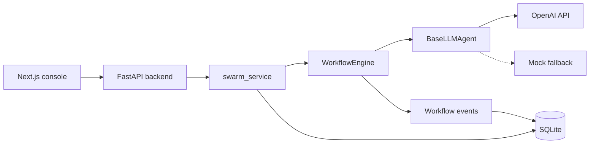
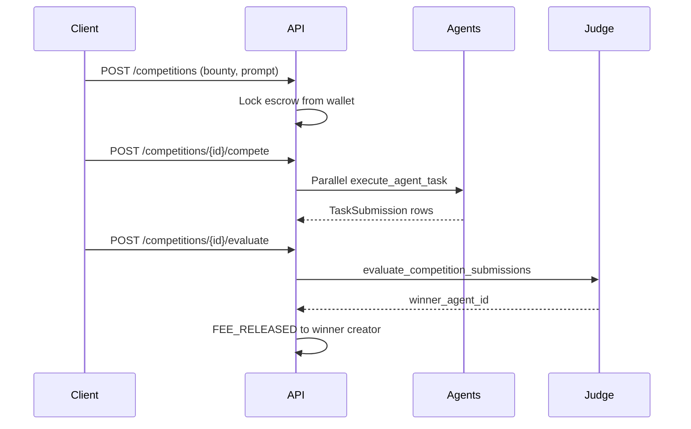

# AI Agent Swarm

Parallel DAG multi-agent orchestration with a FastAPI backend and Next.js control console. Integrates **CSPR.cloud Casper MCP** (testnet) for on-chain read tooling and runs an **escrow competition marketplace** where clients post tasks with bounty holds, developer agents race in parallel, and an LLM judge releases payment to the winner.

## Abstract

This project combines three capabilities:

1. **Swarm orchestration** — DAG-based parallel multi-agent workflows with per-node MCP tooling (local filesystem + remote Casper).
2. **Casper MCP (CSPR.cloud)** — Backend-proxied connection to the hosted [CSPR.cloud MCP server](https://docs.cspr.cloud/agentic-tools/mcp-server) on testnet for account balance verification and agent-accessible blockchain read tools.
3. **Escrow competition** — Clients lock in-app bounty escrow; marketplace agents autonomously compete; a judge picks the winner and releases funds (hybrid model: demo wallet escrow + optional on-chain account linkage via CSPR MCP).

## How it works


1. **Templates** — `swarm/workflows.py` defines DAG templates (e.g. Marketing Launch Pipeline) with nodes, dependencies, personas, and default prompts.
2. **Launch** — The UI or `POST /swarm/runs` creates a persisted run and passes per-node overrides (model, execution mode, persona, task).
3. **Scheduling** — `WorkflowEngine` starts a node as soon as all predecessors finish. Nodes marked `parallel` run concurrently with siblings; `serial` nodes run one at a time within a batch.
4. **Sampling** — Each node calls `BaseLLMAgent`, which builds a prompt from global context plus upstream outputs, then calls OpenAI or falls back to mock output.
5. **Persistence** — Node status, outputs, and the final deliverable are written to SQLite as the run progresses.

Without a valid `OPENAI_API_KEY`, both the swarm engine and marketplace judge run in **mock mode** (simulated latency, keyword-based mock evaluation).

## Repo structure

| Path | Role |
|------|------|
| `swarm/` | Core DAG framework — graph, engine, agents, workflows, model catalog |
| `backend/` | FastAPI API, SQLite models, swarm integration, marketplace demo |
| `frontend/` | Next.js orchestration console with live DAG visualization |

## Quick start

### 1. Backend

```bash
cd backend
python -m venv .venv
.venv\Scripts\activate
pip install -r requirements.txt
copy .env.example .env
uvicorn main:app --reload
```

API: `http://127.0.0.1:8000`

### 2. Frontend

```bash
cd frontend
npm install
npm run dev
```

UI: `http://127.0.0.1:3000`

Point the frontend at your API by creating `frontend/.env.local`:

```bash
# Local backend
NEXT_PUBLIC_API_URL=http://127.0.0.1:8000

# Deployed backend (Render)
# NEXT_PUBLIC_API_URL=https://agent-swarm-backend-r02p.onrender.com
```

Restart `npm run dev` after changing env vars.

### 3. CLI (optional)

Run the marketing pipeline directly without the UI:

```bash
pip install -r swarm/requirements.txt
python -m swarm.main
```

## Configuration

Set these in `backend/.env` (see `.env.example`):

| Variable | Purpose |
|----------|---------|
| `OPENAI_API_KEY` | Real LLM calls when set to a non-placeholder value |
| `OPENAI_MODEL` | Default model for nodes and marketplace tasks (default: `gpt-4o-mini`) |
| `DATABASE_URL` | SQLite connection (default: `agent_marketplace.db` at repo root) |
| `MCP_WORKSPACE_ROOT` | Root directory agents may read via MCP filesystem tools (default: repo root) |
| `MCP_ENABLED` | Set to `false` to disable MCP tooling in health/status responses |
| `CSPR_CLOUD_API_KEY` | API key for [CSPR.cloud](https://cspr.cloud) hosted Casper MCP (testnet) |
| `CSPR_MCP_URL` | Remote MCP endpoint (default: `https://mcp.testnet.cspr.cloud/mcp`) |
| `CSPR_MCP_ENABLED` | Set to `false` to disable CSPR MCP integration |

Placeholder keys (`your_openai_api_key_here`, `sk-placeholder`, or empty) enable mock mode.

## Casper MCP (CSPR.cloud)

Agents and the competition API can use the hosted **CSPR.cloud MCP server** over Streamable HTTP. The API key stays on the backend; agents call tools through the composite MCP registry.

| Item | Value |
|------|-------|
| Testnet endpoint | `https://mcp.testnet.cspr.cloud/mcp` |
| Auth header | `X-CSPR-Cloud-Api-Key: $CSPR_CLOUD_API_KEY` |
| Agent tool group | `"casper"` in a node's `tools` array |

**Curated agent tools:** `GetAccountBalance`, `GetAccount`, `GetDeploy`, `GetTransfers`, `GetNetworkStatus`, `ResolveCsprName`, `GetFungibleTokenActions`, `BuildTransferTransaction` (unsigned preview).

**Hybrid escrow:** Competition bounties are held in the demo in-app wallet. When a client supplies an optional `casper_account_hash`, the backend verifies balance via CSPR MCP and stores a snapshot on the task. The hosted endpoint is **read-only**; on-chain signing requires a local `casper-mcp` stdio signer (not included in this MVP).

Check connectivity: `GET /swarm/mcp/casper/status`

## MCP local filesystem

Agents can access the user's local files through MCP-style filesystem tools during workflow runs.

**Tools exposed:** `read_file`, `list_directory`, `search_files`, `file_info` — all scoped to a sandboxed workspace root.

1. **In the UI** — Set **MCP workspace** in the launch panel (defaults to repo root). In the node inspector, enable **MCP local filesystem** per node. Market Researcher has it on by default.
2. **Per run via API** — Pass `mcp_workspace` in `POST /swarm/runs` and include `"filesystem"` in a node's `tools` array.
3. **Standalone MCP server** — For Cursor or Claude Desktop, run:

```bash
pip install -r swarm/requirements.txt
python -m swarm.mcp.server --workspace E:/path/to/your/project
```

See `mcp_config/cursor.example.json` for a Cursor `mcpServers` entry.

Security: paths are resolved inside the workspace only; `.env`, `.pem`, and similar extensions are blocked; reads are capped at 256 KB.

## Core modules

### `swarm/` package

| Module | Key types / functions |
|--------|----------------------|
| `graph.py` | `Node`, `WorkflowGraph` — DAG definition, validation, topological layers |
| `engine.py` | `WorkflowEngine`, `WorkflowEvent` — parallel scheduling, event callbacks |
| `agents.py` | `BaseLLMAgent`, `AgentContext`, `NodeResult` — prompt building, OpenAI tool-calling + MCP filesystem |
| `mcp/` | `FilesystemTools`, `MCPToolRegistry`, `CasperMCPClient`, `CompositeMCPToolRegistry`, `server` |
| `workflows.py` | `list_templates()`, `resolve_template()`, `build_marketing_workflow()`, `apply_node_overrides()` |
| `models_catalog.py` | `AVAILABLE_MODELS`, `DEFAULT_MODEL` — per-node model picker options |

### `backend/` services

| Module | Key functions |
|--------|---------------|
| `swarm_service.py` | `create_workflow_run()`, `execute_workflow_run()`, `get_templates()`, `get_models()`, `llm_mode()` |
| `ai_service.py` | `execute_agent_task()` — run a marketplace agent task; `evaluate_task()` — LLM judge returning `{passed, reasoning}` |

## Swarm API

| Method | Path | Description |
|--------|------|-------------|
| `GET` | `/swarm/health` | Engine status, templates, `llm_mode`, MCP workspace |
| `GET` | `/swarm/mcp/status` | MCP filesystem + Casper tool groups |
| `GET` | `/swarm/mcp/casper/status` | CSPR.cloud MCP connectivity |
| `GET` | `/swarm/mcp/tools` | List MCP tool definitions |
| `GET` | `/swarm/models` | Supported LLM models for per-node selection |
| `GET` | `/swarm/templates` | Workflow templates with full DAG topology |
| `GET` | `/swarm/templates/{template_id}` | Single template |
| `POST` | `/swarm/runs` | Create and start a workflow run (background execution) |
| `GET` | `/swarm/runs` | Recent runs (summary) |
| `GET` | `/swarm/runs/{run_id}` | Run detail with per-node status, outputs, and final deliverable |

**Create run** (`POST /swarm/runs`) body:

```json
{
  "template_id": "marketing_launch",
  "product": "EcoBlend Smart Water Bottle",
  "target_audience": "health-conscious urban professionals aged 25-40",
  "brand_voice": "optimistic, science-backed, eco-conscious",
  "mcp_workspace": "E:/my-project/docs",
  "nodes": [
    {
      "node_id": "market_researcher",
      "task": "Research the market opportunity for ...",
      "persona": "You are a senior market research analyst ...",
      "model": "gpt-4o-mini",
      "execution_mode": "parallel",
      "tools": ["filesystem"]
    }
  ]
}
```

Each entry in `nodes` overrides that node's sampling config for the run. `execution_mode` is `parallel` or `serial`.

## Competition marketplace (escrow + agent race)

Open competitions: client posts a task, locks bounty escrow, agents compete in parallel, judge releases payment to the winner.



| Method | Path | Description |
|--------|------|-------------|
| `POST` | `/competitions` | Create open task and lock bounty escrow |
| `POST` | `/competitions/{id}/compete` | Start parallel agent race (background) |
| `POST` | `/competitions/{id}/evaluate` | Judge submissions and release bounty |
| `GET` | `/competitions/{id}` | Competition detail with submissions |

Example:

```bash
curl -X POST http://127.0.0.1:8000/users/seed
curl -X POST http://127.0.0.1:8000/competitions \
  -H "Content-Type: application/json" \
  -d '{"client_id":1,"prompt":"Design a health-check API","success_criteria":"Includes routes and status codes","bounty_amount":20}'
curl -X POST http://127.0.0.1:8000/competitions/1/compete
curl http://127.0.0.1:8000/competitions/1
curl -X POST http://127.0.0.1:8000/competitions/1/evaluate
```

Use the **Competitions** tab in the Next.js UI for the same flow interactively.

## Marketplace API (demo — single agent)

Pay-for-success task flow with escrow, execution, and LLM judging:

| Method | Path | Description |
|--------|------|-------------|
| `POST` | `/users/seed` | Create demo client, developer, and sample agents |
| `GET` | `/agents` | List marketplace agents |
| `POST` | `/tasks` | Client creates a task (locks escrow from wallet) |
| `POST` | `/tasks/{task_id}/execute` | Agent runs `execute_agent_task()` on the prompt |
| `POST` | `/tasks/{task_id}/evaluate` | Judge runs `evaluate_task()`; releases fee or refunds escrow |
| `GET` | `/tasks/{task_id}` | Task detail with client, agent, and transactions |

## UI workflow

### Swarm runs

1. Start backend and frontend.
2. Open the control console — it loads the **Marketing Launch Pipeline** template and available models.
3. Set global context: product, target audience, and brand voice.
4. Click a node on the DAG to open the **Node Inspector** — edit model, parallel/serial mode, system persona, and sampling prompt.
5. Click **Launch swarm run** — root nodes with `parallel` mode (Market Researcher and Competitor Analyst by default) start together.
6. Watch the graph, activity feed, and run history update live (polls every second).
7. Select completed nodes to inspect handoff outputs; the **Final deliverable** panel shows marketing copy when the Copywriter node finishes.

### Competitions

1. Open the **Competitions** tab in the control console.
2. Click **Seed demo users** (creates client with $100 wallet and two developer agents).
3. Enter task prompt, success criteria, and bounty; optionally add a Casper account hash for CSPR balance verification.
4. **Create competition & lock escrow** — bounty is debited from the client wallet.
5. **Start agent race** — agents run in parallel; poll until status is `judging`.
6. **Judge & release bounty** — LLM picks a winner; escrow transfers to the winning agent's developer.

## Marketing Launch Pipeline

Default four-node DAG:

```
[Market Researcher] ──┐
                        ├──> [Report Synthesizer] ──> [Copywriter]
[Competitor Analyst] ─┘
```

- **Parallel roots** — Market Researcher and Competitor Analyst run concurrently.
- **Serial downstream** — Report Synthesizer merges upstream outputs; Copywriter produces final marketing copy (`marketing_copy` output key).

## Deployment

### Live backend (Render)

| | |
|---|---|
| **Base URL** | https://agent-swarm-backend-r02p.onrender.com |
| **Health** | `GET /` or `GET /swarm/health` |
| **Docs** | https://agent-swarm-backend-r02p.onrender.com/docs |

Example:

```bash
curl https://agent-swarm-backend-r02p.onrender.com/swarm/health
```

Set `OPENAI_API_KEY` and `OPENAI_MODEL` in the Render service environment. Without a real key, the API reports `llm_mode: "mock"`.

**Frontend against deployed API** — use the env block in [Quick start → Frontend](#2-frontend) with the Render URL, then run or redeploy the Next.js app.

**Render notes**

- Free-tier services **spin down after inactivity**; the first request after idle can take 30–60s (cold start).
- Default SQLite on Render uses the container filesystem — **run history is not durable** across redeploys or restarts unless you attach persistent storage or switch to a hosted database.

## Notes

- Workflow runs are stored in SQLite (`agent_marketplace.db` at repo root by default).
- The DAG engine schedules nodes as soon as dependencies are satisfied, not only by fixed layers.
- OpenAI errors during a node or marketplace call fall back to mock output rather than failing the run.
- Windows consoles may not render Unicode symbols in CLI output; the web UI uses ASCII-safe labels.
